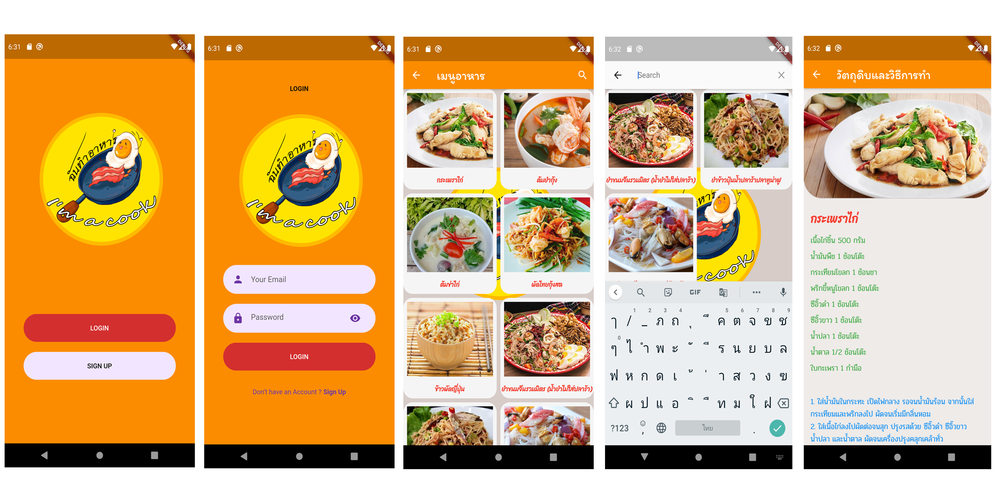

# SimpleToDoList

พัฒนาโดย

นายอัครพล สมโภชน์

นางสาวอัมพร นวลสาร

นายนิพิฐพนธ์ แสงอรุณ

นายสมคิด ระวังชน

นายพิษณุ สุทาศรี

นักศึกษาสาขาวิทยาการคอมพิวเตอร์

คณะศิลปศาสตร์และวิทยาศาสตร์ มหาวิทยาลัยราชภัฏศรีสะเกษ

## Description:

โปรแกรม i'am a cook เป็นโปรแกรมเพื่อใช้สำหรับการค้นหาข้อมูลในการทำอาหาร โดยการอ่านJson เพื่อใช้ในการแสดงผลข้อมูลที่เราค้นหา

เข้าใจในเรื่องการสร้างข้อมูลให้อยู่ในรูปแบบโครงสร้างของ Json และการอ่าน ไฟล์ในโมบายแอปพลิเคชั่น

โมบายแอปพลิเคชั่นนี้พัฒนาขึ้นเพื่อใช้เป็นตัวอย่างในกรณีศึกษาการพัฒนาโมบายแอปพลิเคชั่นด้วย Flutter ในรายวิชาการพัฒนาแอปพลิเคชั่นบนมือถือ เพื่อให้ได้ใช้สำหรับการศึกษา ทดลองปฏิบัติตาม ให้เกิดความรู้ ความเข้าใจ และทักษะในการพัฒนาโปรแกรมบนมือถือด้วย Flutter

โปรแกรมสำหรับบอกวิธีทำอาหารง่ายๆ และส่วนผสม ประกอบด้วย 5 หน้า ได้แก่

1.หน้า WElCOME TO FOODLAND

2.หน้า LOGIN

3.หน้า SIGN UP

4.หน้าเมนูอาหาร

5.หน้าข้อมูลอาหาร วิธีทำ และส่วนผสม

**Packages we are using:**

- fluuter: [link](https://pub.dev/packages/flutter_svg)

- http: [link](https://pub.dev/packages/http)

- flutter_search_Bar: [link](https://pub.dev/packages/flutter_search_bar)

- google_fonts: [link](https://pub.dev/packages/google_fonts)

## การอ่านไฟล์Json

class _MenuPageState extends State<MenuPage> {
  var jsonData;
  List<TemplelData> templeList = [];
  Future<String> _getMenuAPI() async {
    var response = await Http.get(
        'https://akkarapon-sompoht.github.io/templel/foodapp.json');

    jsonData = json.decode(utf8.decode(response.bodyBytes));
    templeList.clear();
    for (var item in jsonData) {
      TemplelData templelData = TemplelData(item['number'], item['name'],
          item['raw_material'], item['how_to'], item['img']);
      templeList.add(templelData);
    }
    if (searchKey == 200) {
      templeListShow = templeList;
    } else {
      print(searchKey);
      templeListShow = templeList
          .where((element) => element.name.startsWith(searchKey))
          .toList();
    }

    return 'jsonData';
  
  }

        child: FutureBuilder(
          future: _getMenuAPI(),
          builder: (context, snapshot) {
            if (snapshot.hasData) {
              return GridView.builder(
                gridDelegate: SliverGridDelegateWithFixedCrossAxisCount(
                  crossAxisCount: 2,
                  childAspectRatio: 8 / 8,
                  crossAxisSpacing: 8,
                  mainAxisSpacing: 8,
                ),
                itemCount: templeListShow.length,
                itemBuilder: (BuildContext ctx, index) {
                  return Container(
                    height: 200,
                    decoration: BoxDecoration(
                        color: Colors.grey.shade100,
                        borderRadius: BorderRadius.all(
                          Radius.circular(
                            20,
                          ),
                        )),
                    child: InkWell(
                      onTap: () {
                        // ! Use templeListShow to display temple data
                        Navigator.push(
                          context,
                          MaterialPageRoute(
                            // ignore: missing_required_param
                            builder: (context) => FoodAppPage(
                              number: templeListShow[index].number,
                              name: templeListShow[index].name,
                              raw_material: templeListShow[index].raw_material,
                              how_to: templeListShow[index].how_to,
                              img: templeListShow[index].img,
                            ),
                          ),
                        );
                      },
                      child: Column(
                        children: [
                          Container(
                            padding: EdgeInsets.all(8.0),
                            decoration: ShapeDecoration(
                              shape: RoundedRectangleBorder(
                                borderRadius: BorderRadius.vertical(
                                  top: Radius.circular(20),
                                ),
                                
                              ),
                            ),
                            child: Image.network(
                              "${templeListShow[index].img}",
                              height: 150,
                              fit: BoxFit.cover,
                            ),
                          ),
                          SizedBox(
                          height: 5,
                          ),
                          ListView(
                            shrinkWrap: true,
                            children: [
                              Container(
                                  alignment: FractionalOffset.center,
                                  width: double.infinity,
                                  child: Text('${templeListShow[index].name}',
                                  style: GoogleFonts.sriracha(
                                  fontSize: 13,
                                  color: Colors.red, 
                                  fontWeight: FontWeight.bold,),
                                  )),
                            ],
                          )
                        ],
                      ),
                    ),
                  );
                },
              );
            }
          },
        ),
      ),
    );
  }
}

class TemplelData {
  int number;
  String name;
  String raw_material;
  String how_to;
  String img;

  TemplelData(this.number, this.name, this.raw_material, this.how_to, this.img);
  startsWith(String searchKey) {}
}

## การส่งข้อมูลระหว่างหน้า

ข้อมูลหน้าแรก(index or menu_screen) ไปยังหน้าที่2 (food_app)

    onTap: () {
                        Navigator.push(
                          context,
                          MaterialPageRoute(
                            // ignore: missing_required_param
                            builder: (context) => FoodAppPage(
                              number: templeListShow[index].number,
                              name: templeListShow[index].name,
                              raw_material: templeListShow[index].raw_material,
                              how_to: templeListShow[index].how_to,
                              img: templeListShow[index].img,
                            ),
                          ),
                        );
                      },

## ตัวอย่างหน้าจอ

